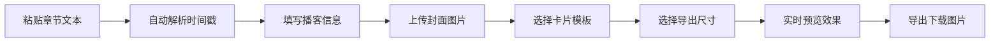

## 1. 产品概述
播客摘要卡片生成器是一款纯前端工具，帮助播客创作者快速生成精美的章节摘要卡片，适用于微博、小红书、朋友圈等社交平台分享。所有操作均在浏览器完成，图片不上传服务器，保护用户隐私。

- 核心价值：将带时间戳的播客章节信息转化为视觉精美的分享卡片
- 目标用户：播客创作者、内容运营者、自媒体从业者
- 市场定位：轻量、高效、无需注册的在线工具

## 2. 核心功能

### 2.1 用户角色
| 角色 | 注册方式 | 核心权限 |
|------|---------|---------|
| 普通用户 | 无需注册 | 使用所有功能，生成和下载卡片 |

### 2.2 功能模块
1. **信息输入模块**：播客基础信息录入、章节内容解析、封面上传
2. **模板选择模块**：四种风格模板切换
3. **实时预览模块**：右侧同步显示编辑效果
4. **导出模块**：竖版/方形图片生成与下载

### 2.3 页面详情
| 页面名称 | 模块名称 | 功能描述 |
|---------|---------|----------|
| 主页面 | 信息输入区 | 播客名称、集数、主持人、嘉宾输入框 |
| 主页面 | 章节解析区 | 粘贴带时间戳的文本，自动解析时间和标题 |
| 主页面 | 封面上传区 | 拖拽或点击上传封面图片，本地预览 |
| 主页面 | 模板选择区 | 四种风格卡片模板切换按钮 |
| 主页面 | 尺寸选择区 | 竖版(9:16)、方形(1:1)切换 |
| 主页面 | 实时预览区 | 右侧实时渲染卡片效果 |
| 主页面 | 导出按钮区 | 生成并下载PNG图片 |

## 3. 核心流程
用户粘贴章节文本 → 系统自动解析时间戳和标题 → 填写播客基础信息 → 上传封面 → 选择模板风格 → 选择卡片尺寸 → 实时预览效果 → 导出下载图片。

## 4. 用户界面设计

### 4.1 设计风格
- **主色调**：深紫蓝(#1a1a2e)作为主色，配合四种模板各自的配色方案
- **按钮风格**：圆角胶囊按钮，悬停有微放大和阴影效果
- **字体**：标题使用「思源黑体 Bold」，正文使用「思源黑体 Regular」，数字使用等宽字体
- **布局风格**：左右分栏布局，左侧表单区，右侧预览区
- **图标风格**：线性简约图标，统一2px描边

### 4.2 四种模板风格

#### 深色播客风
- 配色：深黑背景 + 霓虹渐变（紫→蓝→粉）
- 元素：波形动效、发光边框、赛博朋克感
- 字体：厚重无衬线 + 等宽时间码

#### 知识笔记风
- 配色：米黄纸张底色 + 蓝色墨水 + 红色标注
- 元素：横线纸纹理、手写字体、便签贴效果
- 字体：手写风格 + 衬线字体

#### 复古磁带风
- 配色：橙棕复古色调 + 磁带标签设计
- 元素：磁带卷轴、纸质标签纹理、复古边框
- 字体：复古打印字体 + 标签贴纸风格

#### 极简时间轴风
- 配色：纯白背景 + 单色线条 + 大面积留白
- 元素：时间轴线、圆点标记、极简几何
- 字体：极细无衬线字体

### 4.2 页面设计概述
| 页面名称 | 模块名称 | UI元素 |
|---------|---------|--------|
| 主页面 | 整体布局 | 左右分栏，左侧60%编辑区，右侧40%预览区 |
| 主页面 | 输入表单 | 分组卡片设计，每组有图标和标题 |
| 主页面 | 模板选择 | 四个迷你预览卡片，选中状态有高亮边框 |
| 主页面 | 预览区 | 居中显示卡片，带阴影和比例模拟手机边框 |
| 主页面 | 导出按钮 | 悬浮在预览区底部，渐变色按钮 |

### 4.3 响应式
- 桌面端：左右分栏布局，适合大屏编辑
- 平板端：左右分栏或上下布局
- 移动端：上下布局，先编辑后预览
- 所有表单元素支持触摸操作

