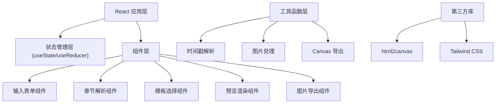

## 1. 架构设计
纯前端单页应用，所有数据和图片处理均在浏览器端完成，无需后端服务。



## 2. 技术描述
- **前端框架**：React@18 + TypeScript
- **构建工具**：Vite@5
- **样式方案**：Tailwind CSS@3
- **图片导出**：html2canvas@1.4.1（将 DOM 转换为 Canvas 再导出 PNG）
- **后端**：无（纯前端应用）
- **数据库**：无（使用 localStorage 本地存储草稿）

## 3. 核心技术方案

### 3.1 时间戳解析算法
支持多种时间戳格式：
- `00:00` 分:秒
- `01:23:45` 时:分:秒
- `[00:00]` 带方括号
- `(00:00)` 带圆括号
- `00:00 - 标题` 横杠分隔
- `00:00 标题` 空格分隔

正则表达式：`/[\[\(]?(\d{1,2}:\d{2}(?::\d{2})?)[\]\)]?\s*[-:：\s]\s*(.+)/`

### 3.2 图片导出方案
使用 html2canvas 库将预览区域 DOM 转换为 Canvas，然后：
1. 设置导出尺寸：竖版 1080×1920 (9:16)，方形 1080×1080 (1:1)
2. 启用 `scale: 2` 保证高清输出
3. 使用 `useCORS: true` 处理跨域图片
4. 通过 `canvas.toDataURL('image/png')` 生成下载链接

### 3.3 组件结构
```
src/
├── components/
│   ├── EditorPanel.tsx      # 左侧编辑面板
│   ├── PreviewPanel.tsx     # 右侧预览面板
│   ├── PodcastForm.tsx      # 播客信息表单
│   ├── ChapterInput.tsx     # 章节输入与解析
│   ├── CoverUpload.tsx      # 封面上传
│   ├── TemplateSelector.tsx # 模板选择器
│   ├── SizeSelector.tsx     # 尺寸选择器
│   ├── ExportButton.tsx     # 导出按钮
│   └── templates/
│       ├── DarkPodcast.tsx  # 深色播客风模板
│       ├── KnowledgeNote.tsx # 知识笔记风模板
│       ├── RetroTape.tsx    # 复古磁带风模板
│       └── MinimalTimeline.tsx # 极简时间轴风模板
├── hooks/
│   └── usePodcastCard.ts    # 状态管理 Hook
├── utils/
│   ├── chapterParser.ts     # 章节解析工具
│   └── exportImage.ts       # 图片导出工具
├── types/
│   └── index.ts             # 类型定义
├── App.tsx
├── main.tsx
└── index.css
```

## 4. 数据类型定义

```typescript
interface Chapter {
  id: string;
  time: string;
  seconds: number;
  title: string;
}

interface PodcastInfo {
  name: string;
  episode: string;
  host: string;
  guest: string;
  cover: string | null;
}

type TemplateType = 'dark' | 'note' | 'retro' | 'minimal';
type SizeType = 'portrait' | 'square';

interface CardState {
  podcast: PodcastInfo;
  chapters: Chapter[];
  template: TemplateType;
  size: SizeType;
}
```

## 5. 关键实现点

### 5.1 实时预览
使用 React 状态驱动，任何输入变化立即反映到预览组件。通过 CSS 变量控制不同模板的配色方案。

### 5.2 本地存储
使用 `localStorage` 自动保存用户输入的草稿，刷新页面不丢失数据。

### 5.3 封面图片处理
使用 `FileReader` 读取本地图片为 Base64，不经过服务器，保护隐私。支持拖拽上传和点击上传。

### 5.4 响应式布局
- `>= 1024px`：左右分栏布局
- `< 1024px`：上下堆叠布局
- 预览区保持固定比例缩放显示

